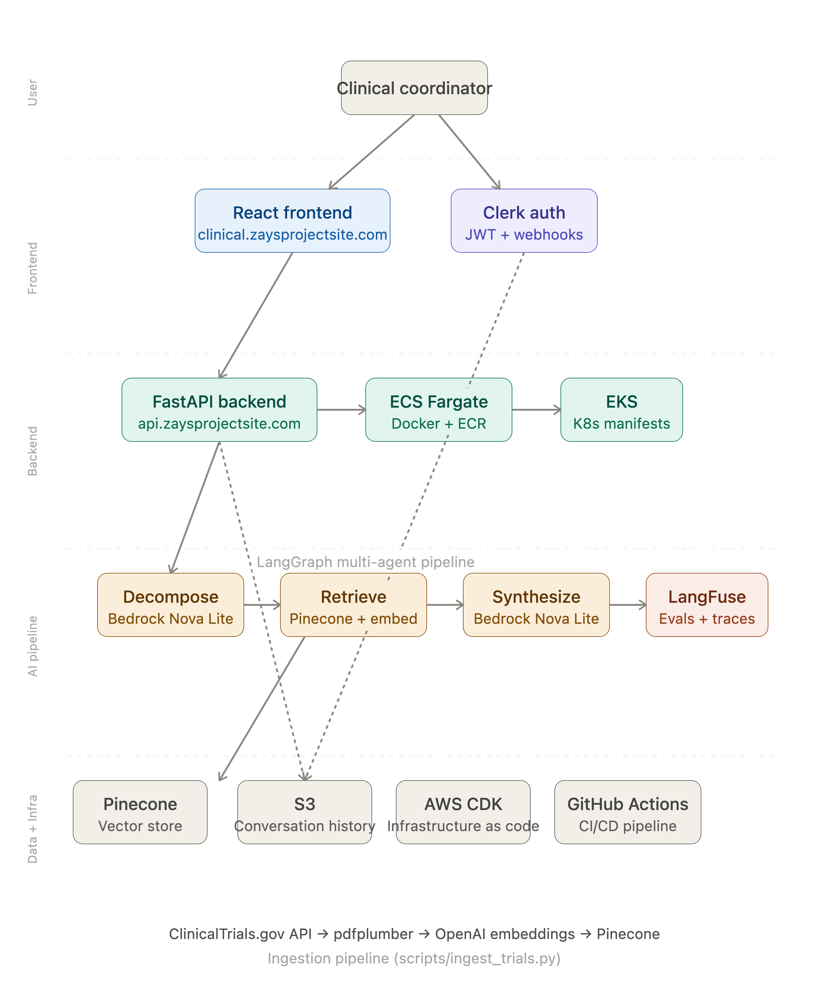

# Clinical Trial Protocol Assistant

An AI-powered assistant for clinical trial coordinators. Instead of manually searching through dense protocol documents, coordinators can ask natural language questions and receive cited, accurate answers grounded in the actual protocol document.

**Live demo:** [clinical.zaysprojectsite.com](https://clinical.zaysprojectsite.com)  
**Username:** `demo`  
**Password:** `Demo1234!`

---

## What It Does

Clinical trial coordinators work with complex, lengthy protocol documents — eligibility criteria, dosing schedules, adverse event reporting procedures, lab requirements. Finding specific information under time pressure is difficult and error-prone.

This assistant ingests protocol PDFs into a vector database and lets coordinators ask questions in a conversational interface. Questions like:

- *"What are the eligibility criteria for this trial?"*
- *"What is the dosing schedule for pembrolizumab?"*
- *"What happens if a patient has a Grade 3 adverse event?"*
- *"What labs are required at the Week 6 visit?"*

Each answer includes citations pointing back to the specific chunks of the protocol document it was sourced from.

---

## Architecture



---

## How It Works

Queries go through a three-node LangGraph multi-agent pipeline:

1. **Decompose** — A Bedrock Nova Lite agent breaks multi-part questions into focused sub-questions
2. **Retrieve** — Each sub-question is embedded (OpenAI text-embedding-3-small) and used to query Pinecone, returning the most relevant protocol chunks. Each chunk is tagged with a section label (Eligibility, Medication, Adverse Events, etc.) via LLM-based metadata classification at ingestion time
3. **Synthesize** — A second Bedrock Nova Lite agent combines the retrieved context into a coherent, cited answer

LangFuse tracks every trace with custom LLM-as-judge evaluators for hallucination detection and context relevance scoring.

---

## Tech Stack

**AI/ML:** LangGraph, LangChain, LiteLLM, AWS Bedrock (Nova Lite), Pinecone, OpenAI, LangFuse

**Infrastructure:** AWS CDK, ECS Fargate, EKS, Docker, ECR, S3, Secrets Manager, ACM

**Backend:** FastAPI, Python, Clerk auth

**CI/CD:** GitHub Actions

**Frontend:** React, Vercel

---

## Key Engineering Decisions

**Why LangGraph?** The decompose → parallel retrieve → synthesize pattern allows multi-part clinical questions to be answered by fan-out retrieval in parallel, then synthesized into a single coherent response. The Send API enables this fan-out natively.

**Why Bedrock?** AWS Bedrock provides a BAA-eligible LLM inference path — critical for any system that could eventually process PHI. Using it from the start establishes the right architectural pattern for a regulated environment.

**Why LangFuse?** LangFuse traces every agent call and runs automated evaluations after each query. Hallucination scores consistently land at 0.05–0.1, validating that the synthesize agent stays grounded in retrieved context.

**Why CDK?** All infrastructure is defined as Python code — VPC, ECS cluster, EKS cluster, load balancer, ACM certificate, IAM roles, Secrets Manager references. The same stack deploys to both ECS (cost-efficient for demos) and EKS (production Kubernetes).

---

## Running Locally

```bash
git clone https://github.com/AcceptableSpring1/clinical-trial-repo
cd clinical-trial-repo

# Copy environment variables
cp .env.example .env
# Fill in: OPENAI_API_KEY, PINECONE_API_KEY, LANGFUSE_PUBLIC_KEY, LANGFUSE_SECRET_KEY,
# LANGFUSE_BASE_URL, AWS_DEFAULT_REGION, CLERK_SECRET_KEY, CLERK_JWKS_URL, CLERK_WEBHOOK_SECRET

# Install dependencies
uv sync

# Run the backend
uvicorn main:app --reload
```

Frontend runs separately:

```bash
cd clinical-trial-frontend
npm install
npm run dev
```

---

## Ingesting Clinical Trials

The `scripts/ingest_trials.py` script pulls protocol PDFs directly from the ClinicalTrials.gov API:

```bash
# Change the NCT number in the script, then run:
python scripts/ingest_trials.py
```

Each chunk is classified into a section category (Study Overview, Participation Criteria, Medication, Adverse Events, etc.) by a lightweight LLM call at ingestion time. This metadata enables future filtering improvements.

---

## Known Gaps / Future Improvements

- **Hybrid RAG** — Combining sparse (BM25) and dense vector search would improve retrieval quality for broad/vague queries. Context relevance scores average 0.2–0.3 for general questions; hybrid search is the planned fix
- **LiteLLM Proxy** — Centralizing LLM routing through a LiteLLM proxy would enable model switching, cost tracking, and rate limiting at a platform level
- **Dynamic trial list** — The frontend trial list is currently hardcoded. A `/trials` endpoint backed by a database or S3 metadata store would make the system fully dynamic
- **Automated ingestion** — An EventBridge → Lambda pipeline triggering weekly ingestion from ClinicalTrials.gov is the production pattern
- **HTTPS already implemented** — ACM certificate with HTTPS listener and HTTP redirect on the load balancer

---

## Deployment

The CI/CD pipeline (`.github/workflows/deploy.yml`) on every push to `main`:

1. Builds a Docker image with `--platform linux/amd64`
2. Pushes to ECR
3. Deploys infrastructure with `cdk deploy`
4. Updates kubeconfig and applies Kubernetes manifests

A separate destroy workflow (`.github/workflows/destroy.yml`) triggers manually to tear down the stack.